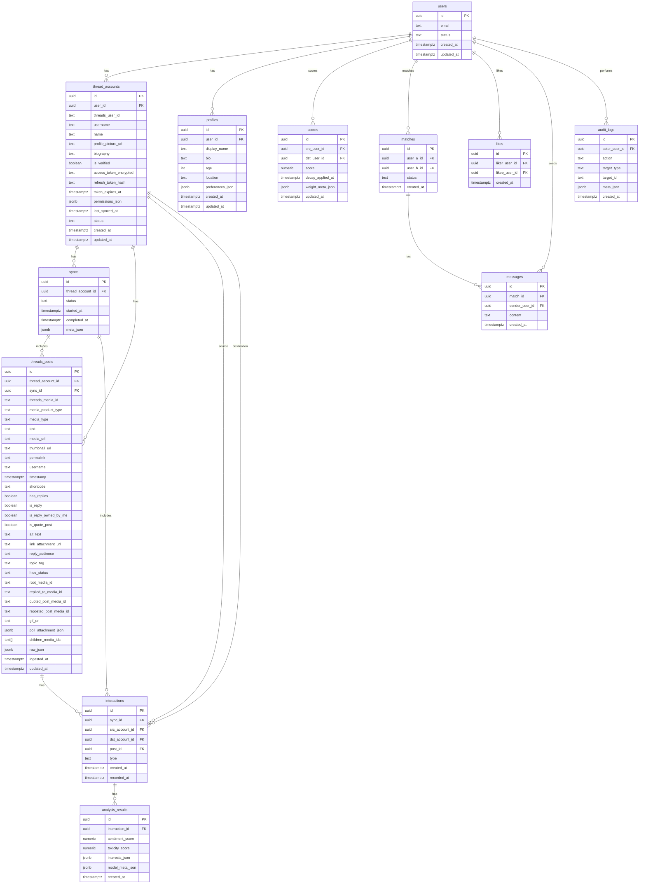

# System Diagrams

The following diagrams visualize key flows and the overall architecture based on the design in `docs/02-design/architecture-design.md`.

## ERD (Entity Relationship Diagram)

## Architecture Overview

Notes:
- Frontend communicates only with the backend API (and optionally object storage for assets).
- Backend API handles OAuth, sessions, and exposes endpoints for ingestion, scoring, and matching.
- Workers perform ingestion and analysis off the request path; a lightweight queue (Redis) is optional for MVP.

## User Authentication - Threads OAuth

Key points:
- Short-lived access token with refresh cookie; httpOnly, SameSite, Secure.
- `GET /me` confirms linkage and ingestion status post-login.

## Data Ingestion from Threads

Notes:
- Use provider IDs (`threads_user_id`, `threads_media_id`) for idempotency.
- Persist `raw_json` for audit and recovery.

## Content Analysis and Scoring

Notes:
- Apply exponential decay by recency; weight interaction types.
- Toxicity threshold gates persistence/visibility.

## User Matching

Notes:
- Keyset pagination for performance; avoid duplicates and recent skips.
- Mutual likes create `matches`; unlock messaging.

## References
- Architecture: `docs/02-design/architecture-design.md`
- API: `docs/02-design/API_DOCS.md`
- Deployment: `docs/02-design/DEPLOYMENT.md`
